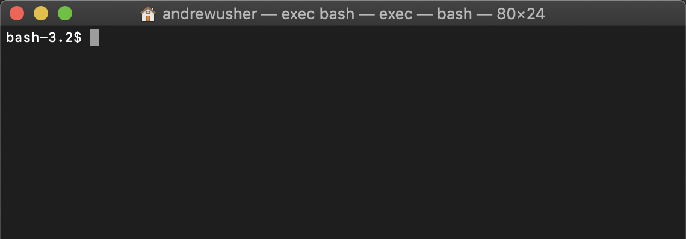
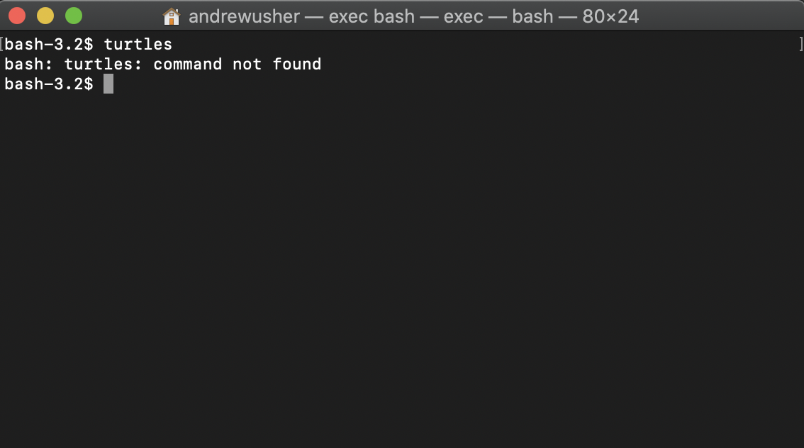
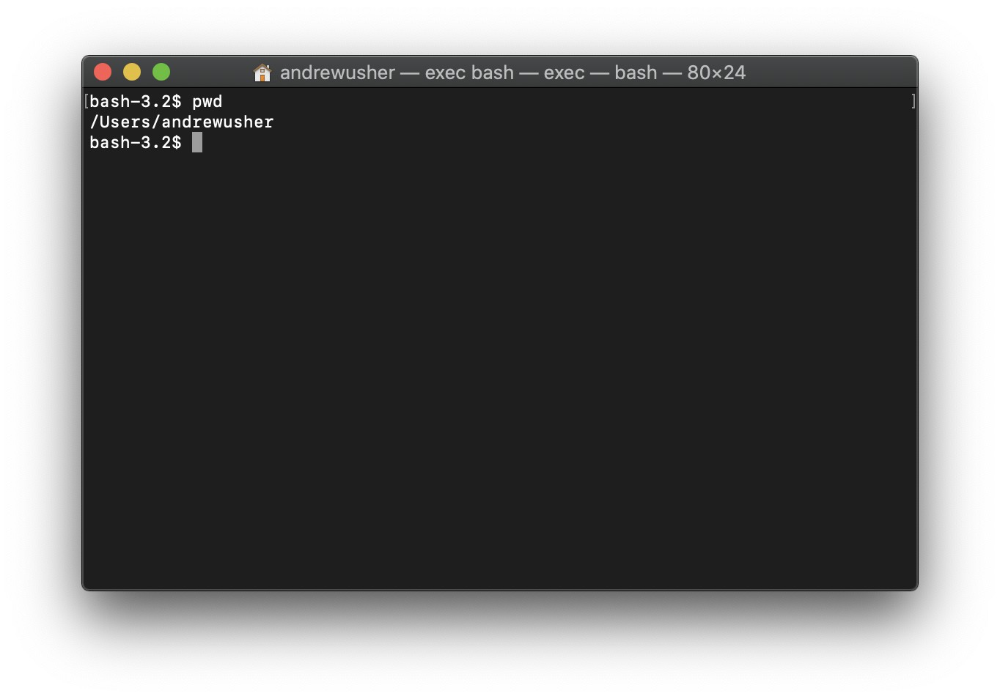
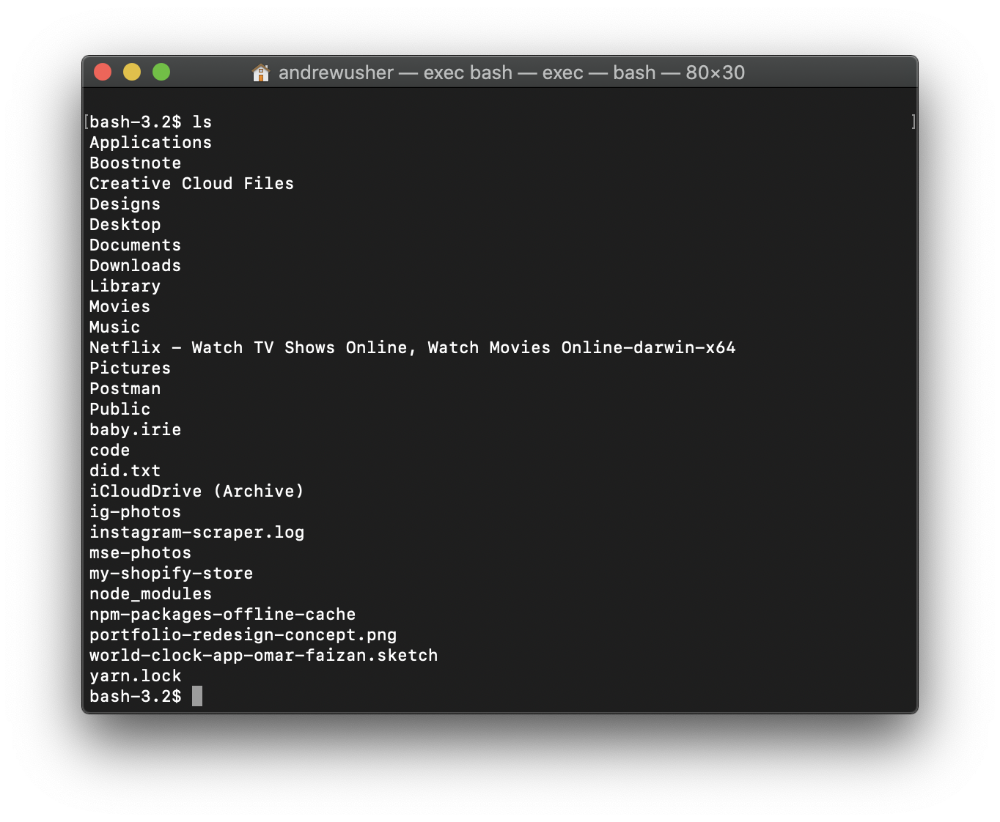

Most tools that help you automate your workflow require the use of the command line. Hence, the first obstacle you have to overcome is getting comfortable with the command line.

But the command line is scary.

Playing with it feels like you’re dismantling a bomb that could go off any moment. One wrong move and that’ll mean the end of your life, and your computer.

I didn’t dare to touch it when I first began to code. I felt that the command line was a tool that only experts could use.

However, as I got to know more about it, I began to realize that the command line isn’t scary at all! It’s incredibly safe, even for beginners, and anyone can use it to help improve their workflow.

In this article I’ll show you why the command line isn’t that scary, and how to start to get comfortable with it.

Ready to go? Let’s begin!

### Starting The Command Line

The command line is a program that takes in written commands and performs them with your operating system.

Your operating system should have a program built in to run the command line. It’s called the Terminal on the Mac, and the Command Prompt on Windows. Fire that up and you’re already looking at the command line.



You don’t see anything you can do with it, there’s no step by step instructions you can follow and everything you type in seems to return an error.

### Nothing you do will break your computer

Even if you entered multiple invalid commands.

When you enter an invalid command, all the command line does is to show you an error message, then do nothing.

Here’s an example if what it does if you enter an invalid command:



You’ll get is a “command not found” error message, then nothing happens. You’re still safe and your computer didn’t explode.

The only command you need to be wary of is the `rm` command. This means to remove files permanently, which deletes your file and leaves it nowhere to be found, not even in your trash.

Next, you’ll want to learn a few commands that you can use with the command line. It comes with a big list of commands, but you’ll only need to know 6 of them.

The 6 commands you need to know are:

1. pwd
2. cd
3. ls
4. mkdir
5. touch
6. clear

#### pwd

pwd means print working directory. All it does is to let you see the location you are at in the terminal.



#### cd

cd means change directory. It allows you to change the current directory to different folders. It is the most used command of all.

When combined with the ls command, you’ll be able to see the folders you can navigate to. If I wanted to navigate to Desktop, all I have to do is to write this:

```
cd Desktop
```

#### ls

ls means list. If you enter this command you’ll get a list of all the files and folders that is in your current location.



#### mkdir

mkdir means make directory. It’s the same as creating a new folder by right clicking with your mouse and selecting create new folder.

#### touch

Touch is the command to create a file. You can create any kind of file with touch.

#### clear

clear means to clear the terminal screen. It’ll remove all the clutter you have on the screen and revert it back to the clean state you had when you open the terminal.
